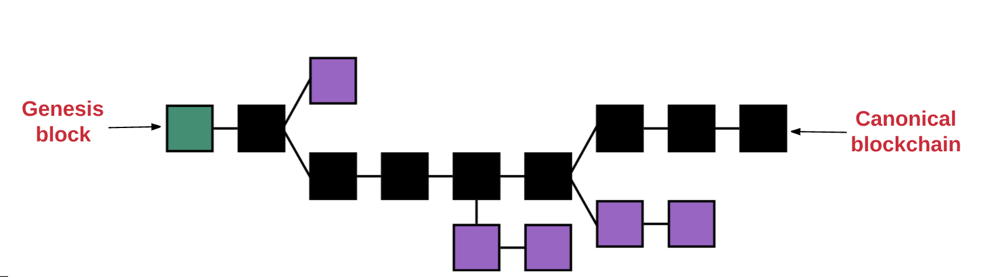

## Simplechain模型说明
 
Simplechain的本质就是一个基于交易的状态机(transaction-based state machine)。在计算机科学中，一个状态机是指可以读取一系列的输入，然后根据这些输入，会转换成一个新的状态出来的东西。

根据Simplechain的状态机，我们从创世纪状态(genesis state)开始。在网络中还没有任何交易的产生状态。当交易被执行后，这个创世纪状态就会转变成最终状态。在任何时刻，这个最终状态都代表着Simplechain当前的状态。

Simplechain的状态有百万个交易。这些交易都被“组团”到一个区块中。一个区块包含了一系列的交易，每个区块都与它的前一个区块链接起来。

为了让一个状态转换成下一个状态，交易必须是有效的。为了让一个交易被认为是有效的，它必须要经过一个验证过程，此过程也就是挖矿。挖矿就是一组节点（即电脑）用它们的计算资源来创建一个包含有效交易的区块出来。

为了让一个区块添加到主链上，一个矿工必须要比其他矿工更快的提供出这个“证明”。通过矿工提供的一个数学机制的“证明”来证实每个区块的过程称之为工作量证明(proof of work)。

证实了一个新区块的矿工都会被奖励一定价值的奖赏。奖赏是什么？Simplechain使用一种内在数字代币—Sipc作为奖赏。每次矿工证明了一个新区块，那么就会产生一个新的Sipc并被奖励给矿工。

不论什么时候只要多个路径产生了，一个”分叉“就会出现。我们通常都想避免分叉，因为它们会破坏系统，强制人们去选择哪条链是他们相信的链。

为了确定哪个路径才是最有效的以及防止多条链的产生，Simplechain使用了一个叫做“GHOST协议(GHOST protocol.)”的数学机制。

    GHOST = Greedy Heaviest Observed Subtree

简单来说，GHOST协议就是让我们必须选择一个在其上完成计算最多的路径。一个方法确定路径就是使用最近一个区块（叶子区块）的区块号，区块号代表着当前路径上总的区块数（不包含创世纪区块）。区块号越大，路径就会越长，就说明越多的挖矿算力被消耗在此路径上以达到叶子区块。使用这种推理就可以允许我们赞同当前状态的权威版本。

