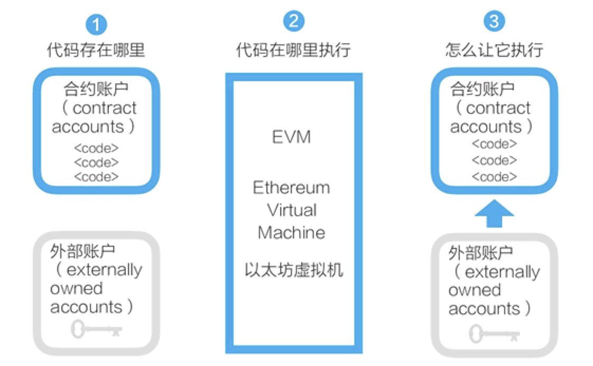

Simplechain的智能合约并非现实中常见的合同，而是存在区块链上，可以被触发执行的一段程序代码，这些代码实现了某种预定的规则，是存在于Simplechain执行环境中的“自治代理”。Simplechain的账户与合约如图 1 所示。

**Simplechain的智能合约设计很简明。**

- 任何人都可以在Simplechain区块链上开发智能合约，这些智能合约的代码是存在于Simplechain的账户中的，这类存有代码的账户叫合约账户。对应地，由密钥控制的账户可称为外部账户。
- Simplechain的智能合约程序，是在Simplechain虚拟机上运行的。
- 合约账户不能自己启动运行自己的智能合约。要运行一个智能合约，需要由外部账户对合约账户发起交易，从而启动其中的代码的执行。

Simplechain和比特币的一个重大不同是，Simplechain提供了图灵完备的编程语言（Solidity）和相应的运行环境（EVM）。所谓图灵完备，指的是这个脚本编程语言可以运行所有可能的计算，而比特币的UTXO模型和脚本只能运行部分计算。

Simplechain比较流行的智能合约语言是Solidity，Solidity 合约类似于面向对象语言中的类。合约中有用于数据持久化的状态变量，和可以修改状态变量的函数。调用另一个合约实例的函数时，会执行一个 EVM 函数调用，这个操作会切换执行时的上下文，这样，前一个合约的状态变量就不能访问了。

