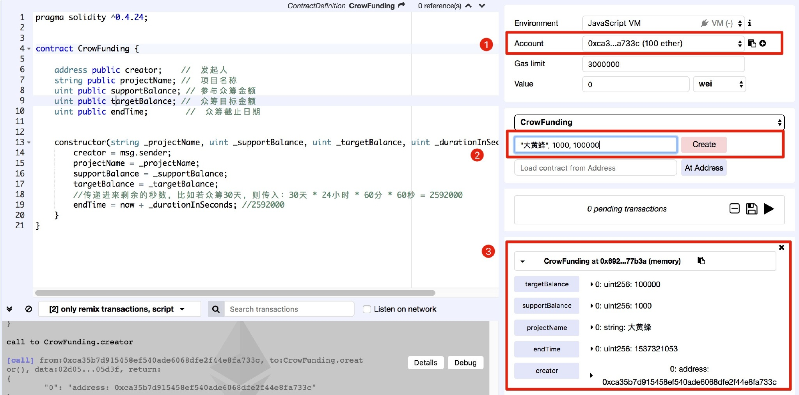
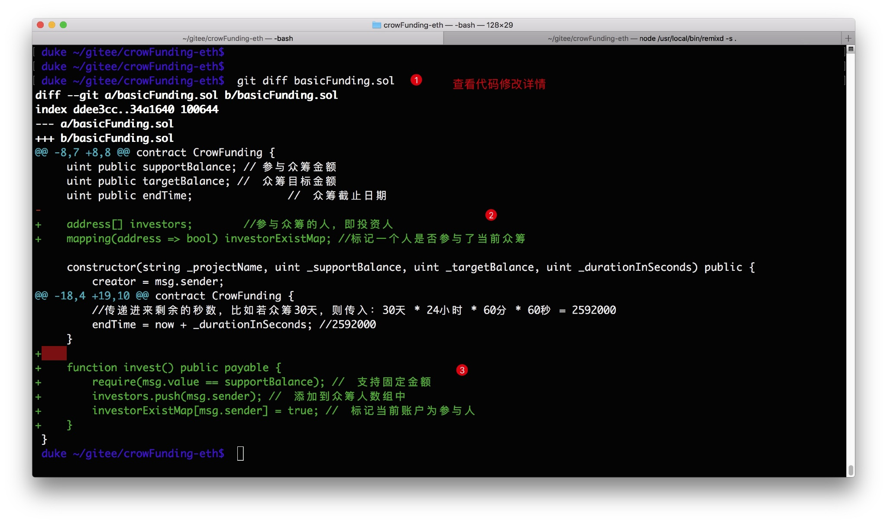
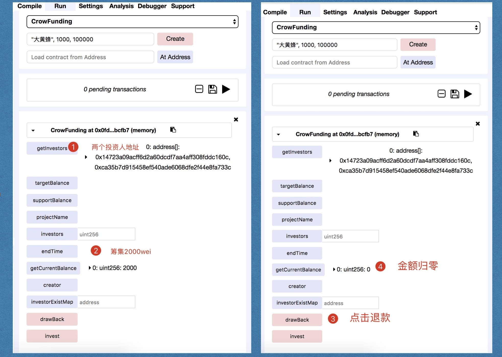
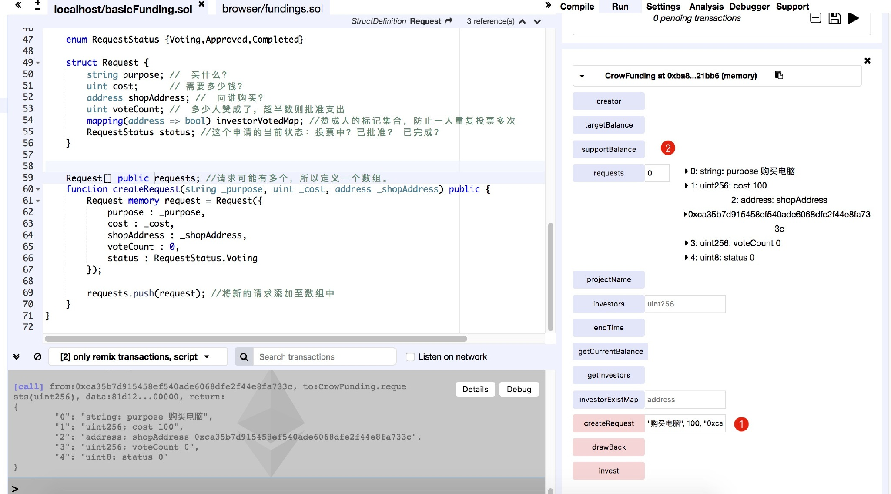

## 一. 项目代码管理

[项目的代码库](https://github.com/SimpleChainFans/funding.git)

## 二. 单个众筹合约实现

### 1.创建空合约CrowFunding

进⼊到项⽬⽬录，创建⽂件`basicFunding.sol`


并添加如下代码：
```go
pragma solidity ^0.4.24;

contractCrowFunding	{

}
```
### 2.基本属性(状态变量)

状态变量|	类型 |	作⽤ 
-|-|-
creator	| address |	项⽬发起⼈，负责创建合约、花费申请、花费执⾏
projectName	| string |	众筹项⽬名称
supportBalance |	uint |	众筹⽀持⾦额
targetBalance	| uint |	众筹项⽬⽬标筹集⾦额
endTime	|uint	| 众筹截⽌⽇期，到此时间时若筹不⻬⾦额则众筹失败

### 3.构造函数实现

```go
pragma solidity ^0.4.24;

contract CrowFunding {
   address public creator; // 发起人
   string public projectName; // 项目名称
   uint public supportBalance; // 参与众筹金额
   uint public targetBalance; // 众筹目标金额 
   uint public endTime; // 众筹截止时间

constructor(string _projectName, uint _supportBalance, uint _targetBalance, uin t _durationInSeconds) public {
   creator = msg.sender;
   projectName = _projectName;
   supportBalance = _supportBalance;
   targetBalance = _targetBalance; 
   //传递进来剩余的秒数，比如若众筹30天，则传入：30天 * 24小时 * 60分 * 60秒 = 2592000 
   endTime = now + _durationInSeconds; //2592000
   } 
}
```
**测试**



### 4.参与众筹

**实现**

添加参与人属性

 address[] public investors; //参与众筹的人，即投资人

参与众筹即向合约中转账，并将参与人的地址添加到集合中，代码如下：

```go
function invest() public payable { 
   require(investorExistMap[msg.sender] == false);//每个人只能参与一次

   require(msg.value == supportBalance); // 支持固定金额
   investors.push(msg.sender); // 添加到众筹人数组中
   investorExistMap[msg.sender] = true; // 标记当前账户为参与人
}
```
为了能够快速校验一个账户是否在参与人数组中，我们提供一个`mapping(address=>bool)`来进行标记，`mapping`的特点是所有的key都默认存在，只不过默认值是`false`，如果不存在，则返回`false`,我们将用户地址作为`key`,设置值为`true`,即可完成索引，mapping是线性索引的，比使用for循环遍历`investors`数组高效且经济，所以还需要添加如下属性：

    mapping(address => bool) public investorExistMap; //标记一个人是否参与了当前众筹

**第二次测试**

当前修改



测试，请部署后按照数字顺序操作


### 众筹失败退款（实现）

退款即将所有筹到的钱逐一退换还给投资者人。同时增加了两个辅助函数，便于测试。
```go
//众筹失败，退款
function drawBack() public {
    for (uint i = 0 ; i < investors.length; i++) {
        investors[i].transfer(supportBalance);
}
//查看合约当前余额
function getCurrentBalance() public view returns(uint) {
    return address(this).balance;
}
//返回所有投资人
function getInvestors() public view returns(address[]) {
    return investors;
}
```
**第三次测试**



### 花费请求(实现)
- 定义结构
众筹成功，项目启动，需要指出一笔费用，这笔费用需要包含如下信息：
1. 用途：买什么？
2. 花费金额：需要多少钱？
3. 商家地址：向谁购买？
4. 当前已经赞成的票数：多少人赞成了，超半数则批准支出
5. 这个花费申请的当前状态：这个申请的当前状态：完成？待批准？代执行？
6. 标记已经投过票的人的集合：mapping(address=>bool),赞成人的标记集合，防止一人投票多次。

根据分析，定义结构代码：

```go
struct Request {
   string purpose; //买什么？
   uint cost; //需要多少钱？
   address shopAddress; // 向谁购买？
   uint voteCount; // 多少人赞成了，超半数则批准支出
   mapping(address => bool) investorVotedMap; //赞成人的标记集合，防止一人重复投票多次
   RequestStatus status; //这个申请的当前状态：投票中？已批准？已完成？
}
```
定义一个枚举，描述申请状态：

```go
enum RequestStatus {Voting,Approved,Completed}
```
- 定义方法
这个函数比较简单，创建一个新的请求结构，然后添加到数组中即可。

代码如下：

```go
Request[] public requests; //请求可能有多个，所以定义一个数组
function createRequest(string _purpose, uint _cost, address _shopAddress) public {
       Request memory request = Request({
           purpose : _purpose,
           cost : _cost,
           shopAddress : _shopAddress,
           voteCount : 0,
           status : RequestStatus.Voting
       });
      requests.push(request); //将新的请求添加至数组中
}
```
**第四次测试**

在`createRequest`中添加参数：

```json
"小胖子减肥", 100, "0xca35b7d915458ef540ade6068dfe2f44e8fa733c"
```
在request中搜索第0个请求，图示如下：



### 批准支付申请

**实现**

项目方发起申请后，由众筹人进行审批，如果投资人不支持。则无需理会，默认为false(不支持)，如果想支持，则需要执行批准动作。即对申请结构的数据进行状态修改，包括：

1. 检验这个人是否投票过，若未通过，则允许投票，反之退出。
2. voteCount 数据加1。
3. 将该投票人再investorVotedMap映射中的值设为true。

代码如下：

```golang
function approveRequest(uint index) public { //􏳥􏳘􏳓􏳮􏷄􏱺􏱊􏱋􏰛􏰜􏱎􏰌􏰍􏵿􏰰􏲸􏷅􏵶􏶧 //require(investorExistMap[msg.sender] == true); //􏲜􏷆􏳝􏲏􏱐􏷇low require(investorExistMap[msg.sender]);
//􏶭􏱲􏶃􏳷􏷈􏰩􏶁􏳗􏱎􏰘􏶛
Request storage request = requests[index];
//􏳮􏷄􏷉􏴃􏵶􏳟􏶧􏰍􏰌􏲓􏲚􏶧 //require(request.investorVotedMap[msg.sender] == false); require(!request.investorVotedMap[msg.sender]);
//􏱇􏱫􏳅􏶉􏳀􏱤􏰍􏷊􏷋􏳅􏶉􏳌􏳤􏶪􏴋􏲠􏰍􏲞􏰮􏰇􏵶􏶧􏲠􏰍􏳺􏲁􏵶􏶧􏰮􏲈􏵥􏷌􏲍􏷍􏲋 require(request.status == RequestStatus.Voting);
//􏰟􏰠􏶧􏰶􏱩1 request.voteCount++;
   //􏰣􏴷􏱷􏳅􏵶􏶧
    request.investorVotedMap[msg.sender] = true;
}
```
