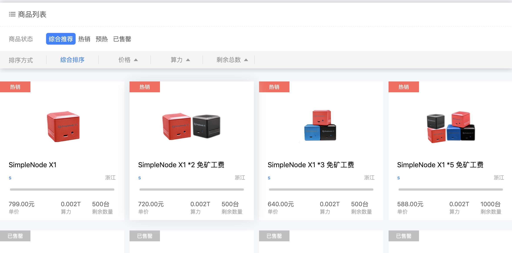

挖矿是获取sipc的一种途径，也是参与到Simplechain生态最底层的一个环节。目前支持Simplechain挖矿的矿池有3家。
分别是:

[Matpool](https://matpool.io)

[Dxpool](https://www.dxpool.com/login)

[Simpool](https://simpool.sipc.vip)

目前可以挖矿的矿机类型主要有两种：

第一种是ASIC矿机，ASIC矿机需要接入矿池才可以进行挖矿。

第二种是小矿机，小矿机[售卖地址](https://www.suanli.com/minerShop/miner)

