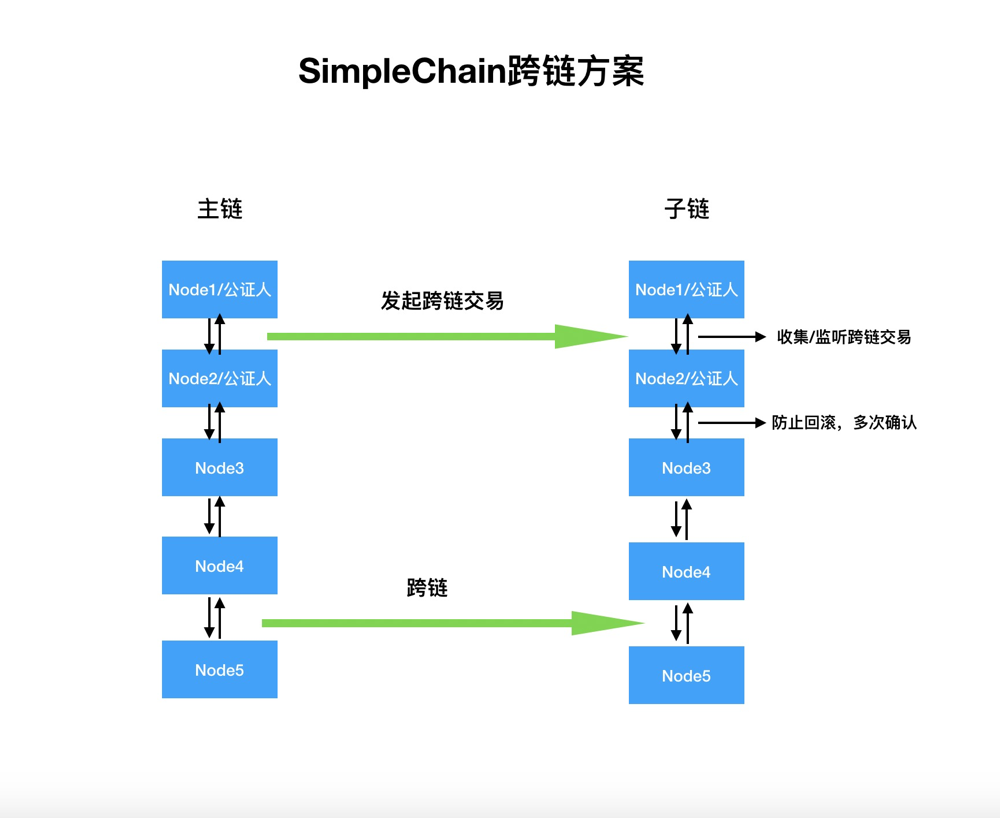
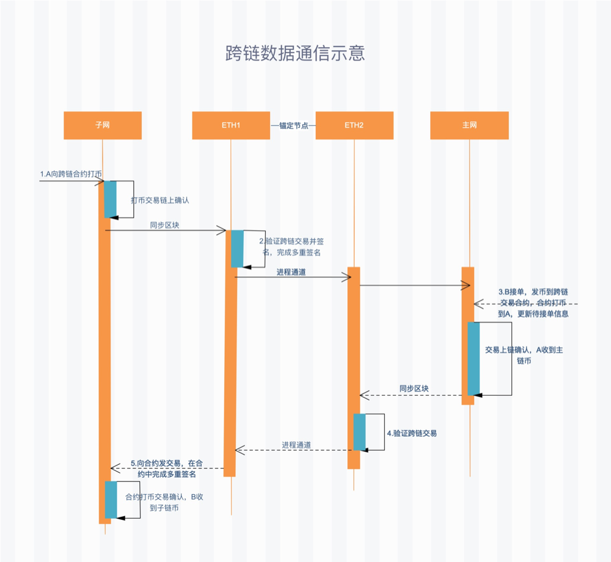

### 自由公证人机制

跨链交互根据所跨越的区块链底层技术平台的不同可以分为同构链跨链和异构链跨链：同构链之间安全机制、共识算法、网络拓扑、区块生成验证逻辑都一致，它们之间的跨链交互相对简单。而异构链的跨链交互相对复杂，比如[Simplechain]()采用 `PoW` 算法而`EOS` 采用`POS`共识算法，它两区块的组成形式和确定性保证机制均有很大不同，直接跨链交互机制不易设计。异构链之间的跨链交互一般需要第三方辅助服务辅助跨链交互。所以设计跨链方案的时候需要设计一套综合

对比目前主流的跨链方案和对跨链的综合性能进行对比 ，以及考虑到后期的方案升级。Simplechain技术团队在公证人机制上设计了自己的跨链方案————自由公证人机制 。为什么选用该跨链技术方案呢？

在“公证人“模式当中，单一的"公证人" 机制以相对中心化的方式运行的，因为在"公证人"机制对于效率的要求要高于去中心化，这就导致单一的公证人体系存在很明显的黑箱风险。但是我们[Simplechain]()的"自由公证人机制"恰恰弥补了"公证人"机制的缺陷，它在不同的区块链平台选择受信任节点的过程中加入了抵押，以及相应的惩罚机制。如果有节点作恶，将会受到相应的惩罚，网络中的"公证人"将会自动被新的公证人顶替掉。所以自由公证人机制可以有效的保证整个跨链过程的完全去中心化，高效和安全。

如果说早期的跨链方案主要目标是资产转移的话，那么SIPC的的跨链方案不仅仅是资产转移，更关注的是跨链基础设施。主要强调资产可以智能合约实现。SIPC的跨链技术立志成为高性能，去中心化的跨链基础设施，同时接入各种跨链应用，着重商业落地。该跨链方案可以使得SIPC在金融领域，政务链，企业区块链解决方案等方向有很强的优势，助力SIPC技术生态成为一套行业区块链解决方案。

以下是SimpleChain跨链方案结构示意图：

该跨链结构包含公证人机制，主子链实现高效通信，通过公证人机制实现资产跨链。比如可以将SimpleChain主链的区块头部信息写入SimpleChain子链的区块里，SimpleChain主链与SimpleChain子链使用相同的共识验证方法，实现两条链之间的通信。通过公证人机制，使用受信任的分布式节点(公证人/node1或公证人/node2)向SimpleChain子链记录证明SimpleChain主链链上发生的交易，通信实现资产跨链交互。简单理解就是SimpleChain主链和SimpleChain子链使用共同信任的分布式节点(node1或者node2)充当公证人，SimpleChain主链和SimpleChain子链就可以间接信任，完成资产交换。

下图是SimpleChain跨链交易的流程图：

跨链交易流程如下：

- 步骤1：子网用户A向跨链交易合约打币。A需支付上链手续费TPC给子网矿工并为步骤5交易手续费预充值。
- 步骤2：锚定矿工群同步区块，识别步骤1中的交易上链，待交易确认后，发起并完成多重签名，形成有效的多重签名信息。
- 步骤3：用户B收到步骤2的多重签名消息，向跨链合约发交易接单。接单交易中会包含多签广播信息，该交易需B支付上链手续费给主网矿工。交易确认后A获得主网货币。
- 步骤4：锚定矿工群同步区块，识别步骤3中的交易上链，待交易确认后，向子网进程发指令。
- 步骤5：锚定矿工子网进程收到步骤4的指令后，向跨链合约发起交易，在合约中完成多重签名。交易确认后B获得`TPC`。
